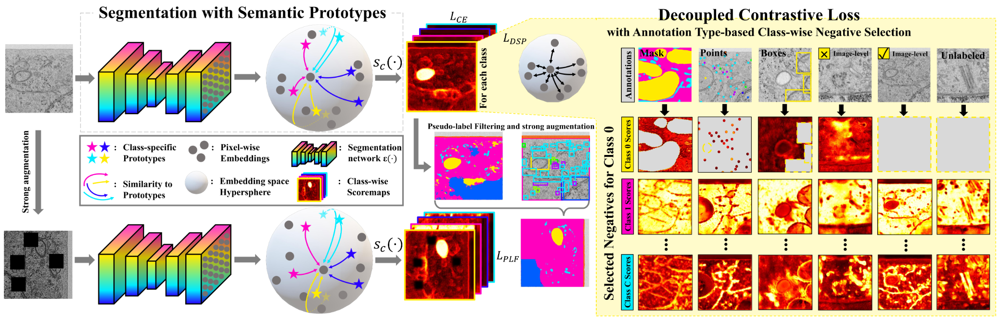

# DSP
A repository containing the code for the paper "Decoupled Semantic Prototypes Enable Learning From Diverse Annotation Types for Semi-Weakly Segmentation in Expert-Driven Domains".



Specifically, we provide the loss function of the DSP approach, a function for pseudo-label filtering as well as the output module to alter any segmentation network towards using semantic prototypes to segment.
All these parts are needed to train a DSP-style segmentation network with diverse annotations such as image-level labels, point annotations, bounding boxes, and pixel-wise mask annotations.

The loss computation includes:

(1) Processing featuremaps as obtained from a segmentation model via the DSP outputhead.

(2) Processing the logits of the DSP outputhead via the DSP loss function.

(3) Processing the logits of the DSP outputhead via the pseudo-label filtering function.

(4) Computing the combined loss function comprised of the DSP losses, pseudo-label-filtering loss and standard cross-entropy loss based on mask annotations.

For a detailed description of the loss function and the training strategy for semi-weakly supervised segmentation as well as results on electron microscopy cell organelle segmentation, please refer to the paper ["Decoupled Semantic Prototypes Enable Learning From Diverse Annotation Types for Semi-Weakly Segmentation in Expert-Driven Domains"](https://openaccess.thecvf.com/content/CVPR2023/html/Reiss_Decoupled_Semantic_Prototypes_Enable_Learning_From_Diverse_Annotation_Types_for_CVPR_2023_paper.html) and the associated supplemental materials.

# Cite
```latex
@InProceedings{Reiss_2023_CVPR,
    author    = {Rei{\ss}, Simon and Seibold, Constantin and Freytag, Alexander and Rodner, Erik and Stiefelhagen, Rainer},
    title     = {Decoupled Semantic Prototypes Enable Learning From Diverse Annotation Types for Semi-Weakly Segmentation in Expert-Driven Domains},
    booktitle = {Proceedings of the IEEE/CVF Conference on Computer Vision and Pattern Recognition (CVPR)},
    month     = {June},
    year      = {2023},
    pages     = {15495-15506}
}